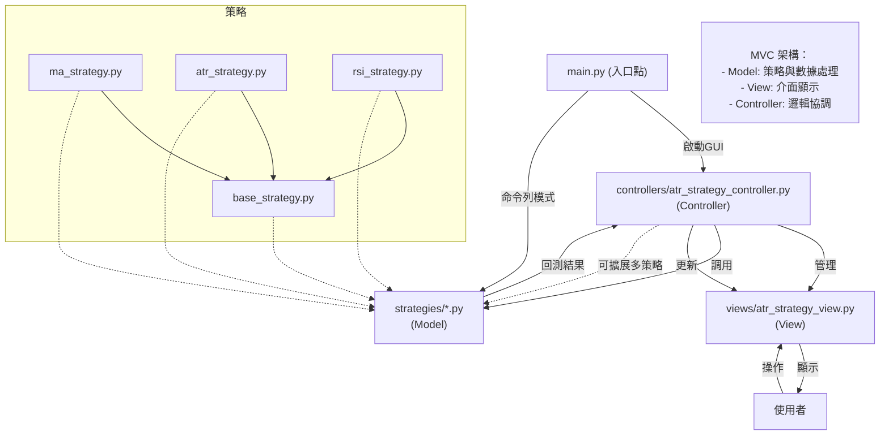

# 系統架構說明

## 1. 架構總覽

本系統為股票交易策略回測平台，採用 **MVC 架構**（Model-View-Controller），支援多種策略（ATR、MA、RSI），可切換命令列與圖形介面。

---

## 2. MVC 架構說明

- **Model（模型）**：
  - 負責策略邏輯、數據處理與回測計算。
  - 主要檔案：`strategies/base_strategy.py`、`strategies/atr_strategy.py`、`strategies/ma_strategy.py`、`strategies/rsi_strategy.py`
- **View（視圖）**：
  - 提供圖形化介面，顯示參數設定、回測結果與圖表。
  - 主要檔案：`views/atr_strategy_view.py`
- **Controller（控制器）**：
  - 負責協調 Model 與 View，處理用戶操作、參數傳遞與回測流程。
  - 主要檔案：`controllers/atr_strategy_controller.py`

---

## 3. 主要檔案職責

| 檔案/資料夾 | 角色 | 說明 |
|-------------|------|------|
| `main.py` | 入口 | 啟動 CLI 或 GUI，負責參數解析與主流程 |
| `controllers/atr_strategy_controller.py` | Controller | 管理策略選擇、參數、回測與結果顯示 |
| `views/atr_strategy_view.py` | View | 提供圖形化介面與圖表顯示 |
| `strategies/base_strategy.py` | Model | 策略基底類別，定義回測與績效計算邏輯 |
| `strategies/atr_strategy.py` | Model | ATR 策略實作 |
| `strategies/ma_strategy.py` | Model | MA 策略實作 |
| `strategies/rsi_strategy.py` | Model | RSI 策略實作 |

---

## 4. 系統流程圖

---

## 5. 架構特色與擴展性

- **多策略支援**：只需新增策略類別即可擴展。
- **介面分離**：CLI/GUI 可自由切換，互不干擾。
- **易於維護**：各層職責明確，便於測試與擴充。

---

> 本文件可直接轉為 PPT 架構簡報使用。 